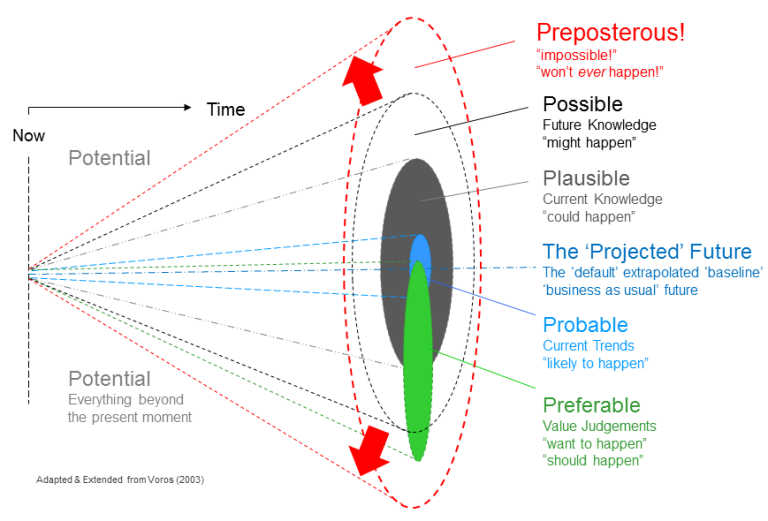
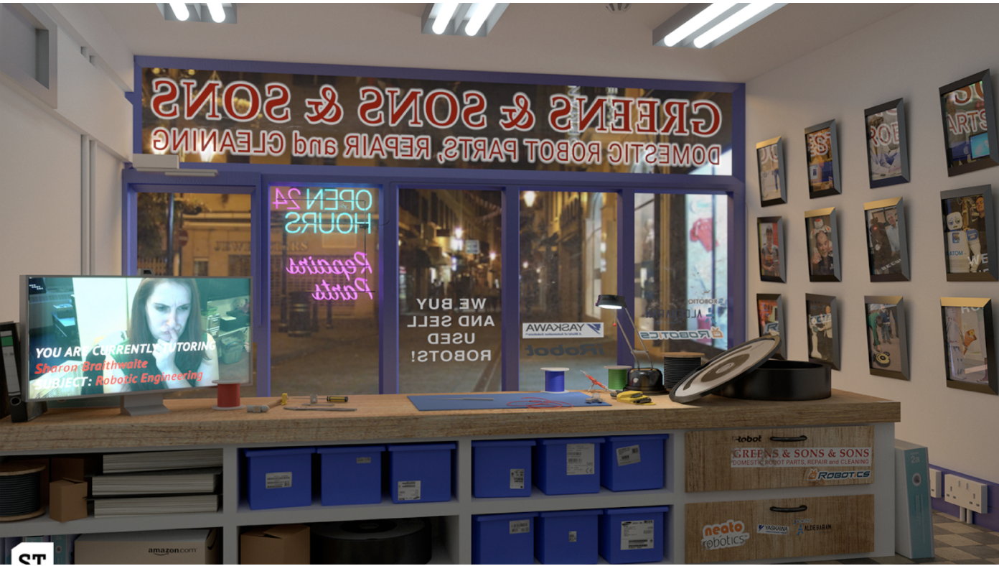

# Introduction to Futures

We've found it helpful to give an introduction to the ideas and process 
and reasoning behind it. Here's a sample workflow.

## Why futures? - 5 minutes

None of us can predict the future, obviously, but we can think about 
what's starting to happen and what that might lead to, and being able to 
do that is largely a matter of habit and attitude. What you get is a 
number of possible futures, some of which might be better than others - 
"preferable" - from our point of view.

Why do we need to think about the future?

Large-scale actors, like corporations and governments, are already doing 
futuring and worldbuilding exercises to envision the kinds of future 
they’d like to exist and diverting resources into making those futures 
happen.

This is fine if that aligns with your own set of preferable futures. But 
if you want to challenge that status quo, you need to imagine your own 
set of preferable futures, and build towards those.

It’s not enough for us to anticipate possible futures: we need to 
actively imagine those where the world exists in a shape we’d like it to 
be, and bring that world into being through our choices and actions.

## What can this do for you? - 5 minutes

We've been developing a set of workshops, designed to help groups of 
people identify trends that are important to them, extrapolate out the 
implications of those trends, and create some objects from those 
possible futures to make them more real, and to use those objects to 
help other people think about those futures too.

The tools in these workshops can help you - as individuals and as a team - 
build imagination, empathy and mental flexibility, and get out of the 
heads-down, short term thinking that means that the future happens to 
you and is not authored by you.

Involving lots of different voices in these kinds of processes improves 
the outcomes. The more different kinds of people we involve, the more 
new information we get, and the more interesting and useful the process 
is.

## Thinking about some existing future objects - 10 minutes

Here are a couple of artefacts that other people have made using a 
Futures process like ours.

Think for two minutes silently on our own about each of these 
pictures. What do they imply about the world that produced it? Imagine 
you live in that world, what would it be like?

_Then discuss these together for a few minutes - it may make sense for 
the facilitators to start, for example:_

_"The robot repair shop makes me think of the right to repair, so I 
suppose that's legally instituted now, which is good. I like that the 
high street still exists. I noticed that the person behind the counter 
is also training someone remotely, which is interssting - maybe there's 
a shortage of trained people or alternatively people have to have 
several jobs to make ends meet". Or_

_"It's interesting that the crickets are low-calorie! Perhaps it's a 
luxury item like a cornish pasty from a specific location, and perhaps 
any animal is quite fancy if it's all plant based in the future?"_

_Try and notice different aspects of the artefacts and follow them 
through. Try to make sure everyone is heard in the discussion. In the 
past we've had some dystopian answers to these, that's ok (obviously) 
but it might make sense in the later parts of the workshop to try to get 
them to focus on positive aspectes, or flip it around._

## Activity - 30 minutes

(2 minutes)
For our activity first find an object near you e.g. a piece of fruit, a 
book, headphones, fidget spinner... Get up and move around! Bring it 
here, show it on camera, maybe take a picture of it

(5 minutes)
Now think on your own for 5 minutes about either the "Maidstone" world 
or the "Robot repair shop" world. Can you tell a story about your object 
in that world? would it be different? the same? how might it have been 
produced differently to now? what would it look like? how would you use 
it? make a few quick notes on your own.

(5 minutes)
Now, in the google spreadsheet, find a free column and write down your 
pairing [e.g. apple and robot shop]. You can add a picture of your 
object if you want to, and your name.

Then write down next to it some of the notes you made above - what this 
object might look like, how it might differ from now (e.g. squarer fruit 
because harvested by robots and they find square objects easier to 
grasp]).

(5 minutes)
Let's go through a couple of these together doing yes and, which is an 
improv technique where you have to keep the idea up in the air like a 
volleyball. I/we will start, then I'll ask you to chime in. No 
wrong answers, no silly answers!

(10 minutes)
Now go and find someone else's idea that appeals to you. Read it and add 
something to it using the improv approach (yes, and...) by writing a line 
underneath it. 

Think about things like: how businesses, politicians, users and the BBC 
might respond to this thing or situation.

(5 minutes)
What comment did you like? what was your favourite? anything surprise you?

## That's weird! signals call to action - 10 minutes

Signals spotting is about spotting trends early. We do this by gathering 
links to news stories, journal articles and other material published 
online which seems to point to a trend, or the first rumblings of 
something starting to happen or change.

Here are some examples:
 * (some) people are looking for jobs that match their values
 * Apple are making it easier to repair its products
 * People are using Tiktok to try to solve true crime, and it's going quite wrong

Next time, please bring with you one interesting "signal" each. Ideally 
it will be something related to your work, however vaguely. For example, 
it could be something to do with the way people are using media, new 
kinds of media, news consumption, music, the internet, online or offline 
behaviours, policy, economics, business, anything like that.

We are looking for things that are unusual or strange or might point to 
something bigger, rather than things that confirm what you already know 
and understand. We're looking for "that's weird!" So look broadly. Try 
to bring your own skills and experence to bear in unearthing something 
unusual and interesting, perhaps something no-one else will have heard of.

Before the next meeting, we'd like you to each think about the following 
3 questions with respect to the most interesting signal that you've 
found:

 1. What is the signal? (a link, a name, a description)
 2. What change is happening? is something increasing / decreasing, getting larger / smaller? What?
 3. Who will it change for? are there winners and losers?

Please put them in this spreadsheet before the next meeting.

Thank you!

## References

 * https://smithery.com/2017/07/23/the-time-capsule-retrieval-service/
 * https://www.howtofuture.com/
